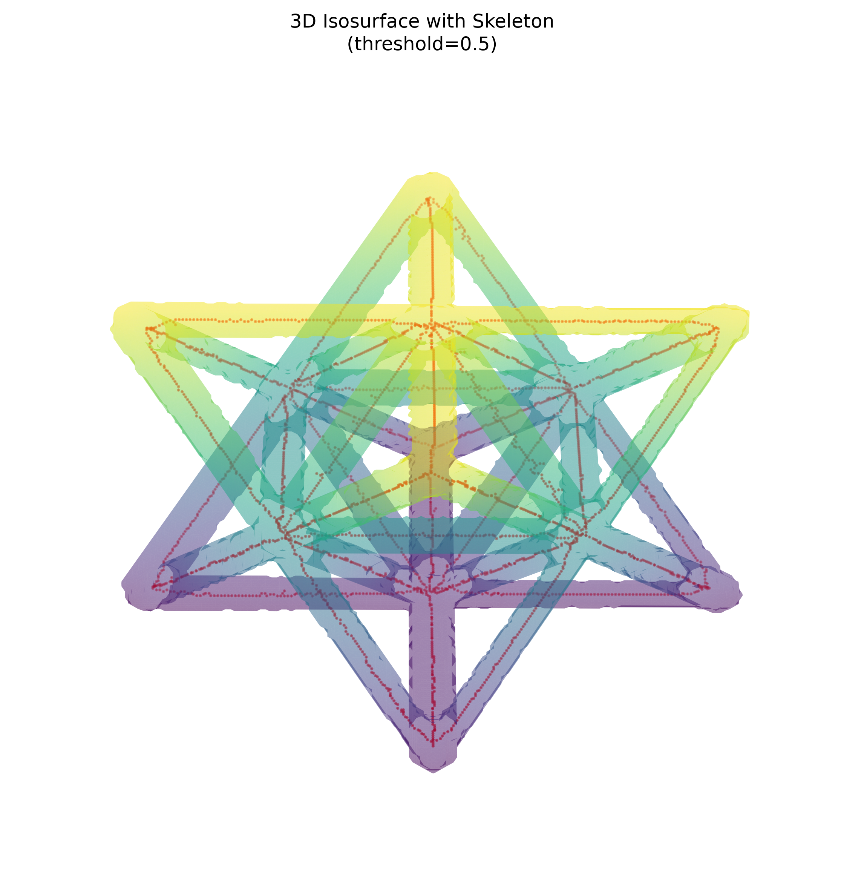
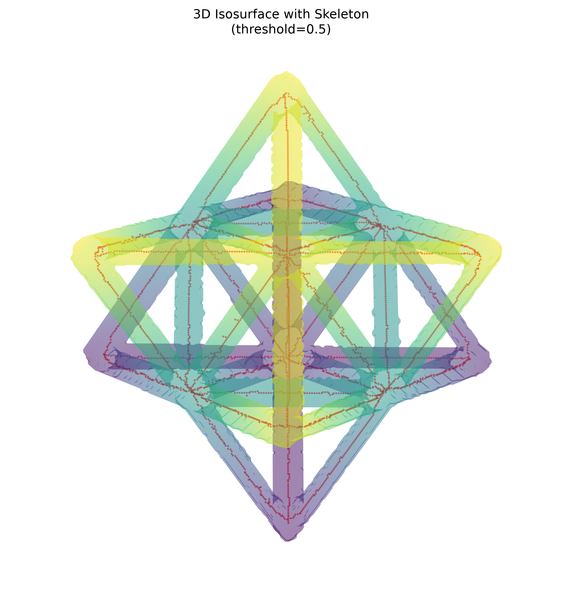

# Non-Destructive Evaluation Report: Unit Cell

## Scope and inputs

This report analyzes the complete, shape-compatible 3D `.npy` set in `data/unitcell`:

- Original volume: `unitcell.npy`
- Segmented mask: `unitcell_mask_otsu.npy`
- Skeleton: `unitcell_skeleton_otsu.npy`

The alternative `unitcell_mask_0p015.npy` contains only 7 foreground voxels and has no matching skeleton, so the Otsu mask/skeleton pair was selected. The 2D center-slice arrays were excluded from the 3D feature calculations. All three selected arrays have shape `256 × 256 × 256`.

## Summary table

| Source | Feature | Result |
|---|---:|---:|
| Volume | Array shape | 256 × 256 × 256 |
| Volume | Total voxel count | 16,777,216 |
| Volume | Mean intensity | 0.000539 |
| Volume | Intensity standard deviation | 0.002418 |
| Volume | Intensity range | −0.003129 to 0.015258 |
| Mask | Foreground volume | 717,733 voxels |
| Mask | Foreground fraction | 4.2780% |
| Mask | Mean foreground intensity | 0.011697 |
| Mask | Foreground intensity standard deviation | 0.001408 |
| Mask | 26-connected components | 1 |
| Skeleton | Skeletal length (voxel count) | 3,184 voxels |
| Skeleton | Skeleton-to-mask voxel ratio | 0.4436% |
| Skeleton | Mean intensity along skeleton | 0.012395 |
| Skeleton | Endpoints | 40 |
| Skeleton | Branch-point voxels | 139 |
| Skeleton | Maximum local degree | 6 |
| Skeleton | 26-connected components | 1 |

## Visual gallery

### View A — elevation 30°, azimuth 45°

### View B — elevation 60°, azimuth 45°

The translucent surface is the Otsu-segmented structure; the red points show the skeleton. The supplied visualization routine downsampled the mask by a factor of two for surface rendering, while skeleton coordinates were scaled to the same display frame.

## Analysis

The mask is well aligned with the reconstructed volume. Its foreground mean intensity (0.011697) is substantially higher than the background mean (0.000040), giving a foreground-to-background mean difference of 0.011656 intensity units. This strong separation is consistent with the mask isolating the high-density lattice material rather than background noise.

The mask forms one 26-connected component, and every one of the 3,184 skeleton voxels lies inside the mask. The skeleton is also a single connected component, indicating that it preserves a continuous centerline representation of the segmented lattice. The 40 endpoints and 139 branch-point voxels reflect a connected, branching truss topology. Branch-point counts are voxel-based rather than counts of merged branch regions, so adjacent high-degree voxels may describe the same physical junction.

No voxel-spacing metadata was available in the `.npy` inputs. Volume and skeletal length are therefore reported in voxel units rather than physical units such as mm³ and mm.

## Method

Arrays were checked for exact shape compatibility before analysis. Foreground volume is the count of nonzero mask voxels. Skeletal length is the count of nonzero skeleton voxels. Endpoint and branch-point metrics use a 26-neighbor 3D graph: endpoints have one occupied neighbor, and branch-point voxels have at least three. Connected-component counts also use 26-connectivity. The two required 3D views were generated with the skill's `3d_visualize.py` routine at the prescribed camera angles.
